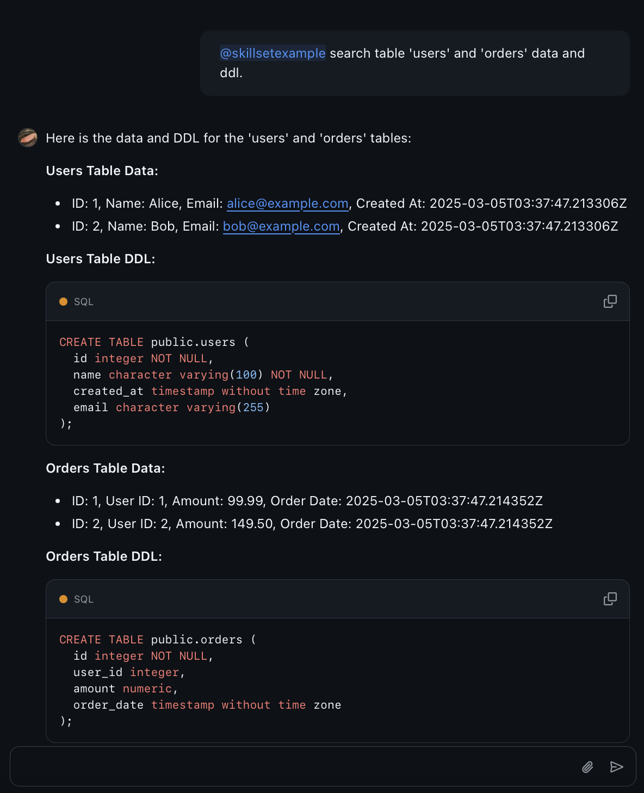

# DB Query Copilot Skillset

This Copilot Skillset allows you to query data from a specified database and return the results.

Sample PG Database: [https://github.com/hank1224/postgres-sample](https://github.com/hank1224/postgres-sample)

## Demo

This project serves to test the capabilities of Copilot Extensions.

Testing demonstrates that Copilot can invoke multiple, distinct skillsets within a single response, rather than being limited to a single skill per query.



## Copilot Skillset Settings

**Name:** run_select_query

**Inference description:**

```plaintext
The function accepts a JSON input with a `table_name` parameter, validates it, and executes a `SELECT *` query on the specified table. It returns the results as a JSON array of rows, with each row represented as a key-value map.
```

**URL:** https://{your-ngrok-domain}/run-select-query

**Parameters:** 
```json
{
   "type": "object",
   "properties": {
      "table_name": {
         "type": "string",
         "description": "The name of the table to query. Must be a valid table name containing only alphanumeric characters and underscores."
      }
   },
   "required": ["table_name"],
   "additionalProperties": false
}
```
---
**Name:** get_table_ddl

**Inference description:** 
```plaintext
This handler receives a JSON input with a table_name. It validates the table_name for security and retrieves the Data Definition Language (DDL) of the specified table from the database. The handler then returns the DDL as a JSON object with the key "ddl".
```

**URL:** https://{your-ngrok-domain}/get-table-ddl

**Parameters:**
```json
{
   "type": "object",
   "properties": {
      "table_name": {
         "type": "string",
         "description": "The name of the table to get it's DDL. Must be a valid table name containing only alphanumeric characters and underscores."
      }
   },
   "required": ["table_name"],
   "additionalProperties": false
}
```
## Copilot Extension Explanation

### Architectural Model
- **Skillsets**: Define up to 5 API endpoints that Copilot can call directly. Copilot handles all AI interactions, prompt engineering, and response formatting.
- **Agents**: Provide full control over the interaction flow, including custom prompt crafting and specific LLM model selection.


### When to Choose Skillsets
Skillsets are ideal when you want to:
- Quickly integrate existing APIs or services without managing AI logic
- Focus purely on your service's core functionality
- Maintain consistent Copilot-style interactions without extensive development
- Get started with minimal infrastructure and setup

Use agents instead if you need:
- Complex custom interaction flows
- Specific LLM model control (using LLMs that aren't provided by the Copilot API)
- Custom prompt crafting
- Advanced state management